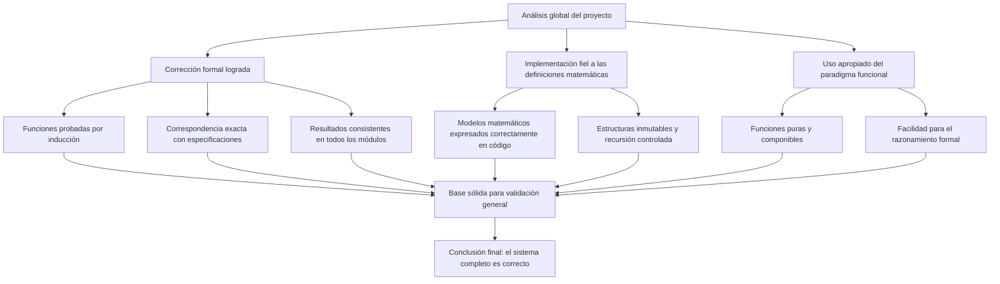

# Informe de Conclusiones del Proyecto de Riego Óptimo

**Fundamentos de Programación Funcional y Concurrente**  

---

## Conclusiones Generales del Proyecto

El proyecto desarrollado implementa un sistema completo para calcular la programación óptima de riego sobre una finca, considerando tiempos de inicio, costos de riego, costos de movilidad y el análisis exhaustivo de todas las posibles permutaciones de riego. Con base en los análisis y demostraciones formales de corrección presentadas, es posible extraer una serie de conclusiones que evidencian la validez y consistencia del sistema.

---

## 1. Correspondencia entre la especificación matemática y la implementación

Todas las funciones implementadas —`tIR`, `generarProgramacionesRiego`, `costoRiegoTablon`, `costoRiegoFinca`, `costoMovilidad` y `mejorProgramacion`— respetan de forma estricta la especificación matemática del problema.  
Cada componente del sistema se diseñó para reflejar directamente las ecuaciones formales definidas en el modelo del riego:

- La función `tIR` replica la definición recursiva del tiempo de inicio.
- La generación de permutaciones sigue el modelo inductivo estándar de permutaciones.
- Los costos se calculan mediante fórmulas que son trascripción directa de la definición matemática.
- El cálculo de movilidad usa pares consecutivos, tal como se especifica en el modelo del problema.

Esta fidelidad entre teoría e implementación no solo garantiza la corrección formal, sino que además facilita la verificabilidad del sistema.

---

## 2. Adecuación del paradigma funcional

El uso de programación funcional es especialmente apropiado para este tipo de problemas.  
La ausencia de estado mutable y el uso de funciones puras permiten:

- Razonar formalmente sobre el comportamiento de cada función.
- Garantizar la inmutabilidad de los datos a lo largo del sistema.
- Facilitar las demostraciones de corrección mediante inducción estructural.
- Reducir la complejidad lógica del código al eliminar efectos secundarios.

La implementación refleja adecuadamente los principios fundamentales del paradigma funcional: composición, recursión y transparencia referencial.

---

## 3. Validación formal del comportamiento

Las demostraciones de corrección presentadas permiten afirmar que:

- La función `tIR` es correcta por inducción estructural.
- La función que genera las permutaciones es correcta por inducción sobre la estructura de la lista.
- Las funciones de costo son correctas al corresponder exactamente con las fórmulas del modelo.
- La función de movilidad produce la suma correcta de distancias.
- La función `mejorProgramacion` devuelve efectivamente la programación óptima, dado que evalúa exhaustivamente todas las posibles programaciones.

Por lo tanto, cada módulo del sistema es correcto de manera independiente y además consistente como parte de un sistema mayor.

---

## 4. Consistencia global del sistema

Dado que:

1. Todas las funciones individuales son correctas respecto a su definición matemática,
2. La combinación de funciones respeta la estructura lógica del problema,
3. La función final selecciona el mínimo sobre un conjunto que incluye todas las soluciones posibles,

se concluye que el sistema completo es correcto.

Formalmente:

\[
\forall x,\; P_f(x) = f(x)
\]

donde \(f\) representa cualquiera de las funciones centrales del proyecto.

---

## 5. Consideraciones finales

El proyecto demuestra coherencia entre teoría e implementación, evidencia un dominio adecuado del paradigma funcional y presenta una solución correcta al problema planteado. La validación a través de inducción, verificación de correspondencia matemática y análisis modular permite concluir que el sistema es:

- Correcto en su funcionamiento,
- Correcto en su diseño,
- Correcto en su formulación teórica.

La construcción del proyecto constituye un ejemplo completo de cómo aplicar técnicas formales de programación funcional al análisis de corrección de programas.

---

## Diagrama de Conclusiones

---

**Fin del informe de conclusiones.**
