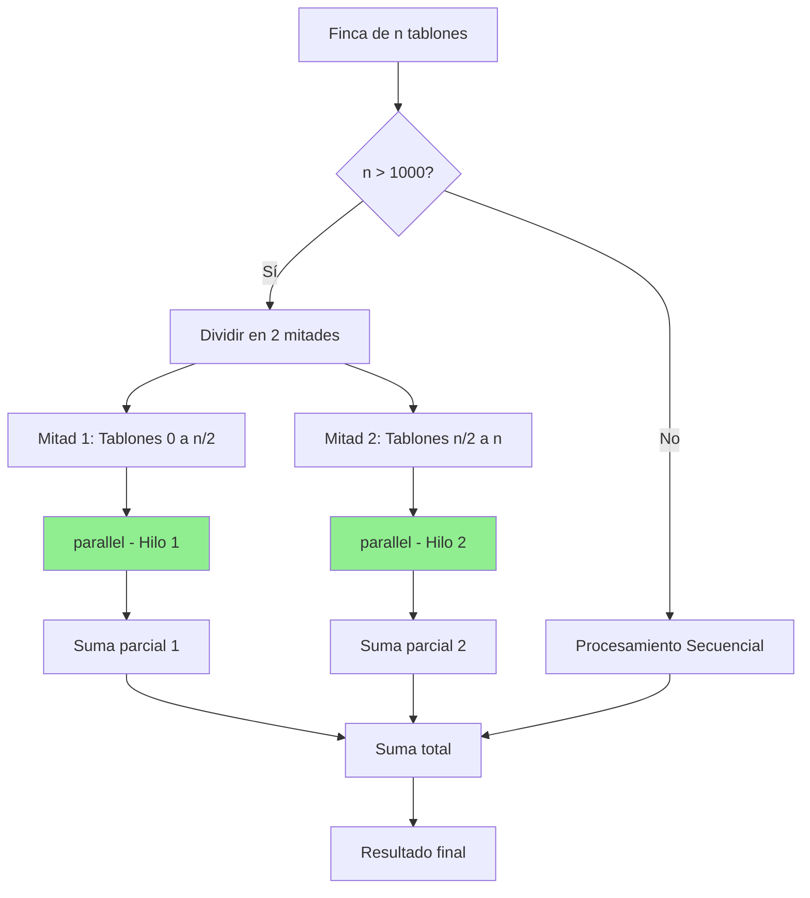

# Informe de Paralelización

## Introducción

Este informe presenta la estrategia de paralelización implementada en el proyecto de Riego Óptimo, analiza los resultados obtenidos mediante benchmarks reales y evalúa la efectividad de las técnicas de paralelismo aplicadas mediante la Ley de Amdahl.

El objetivo principal es determinar en qué casos la paralelización mejora el rendimiento del sistema y cuándo el overhead introducido hace que las versiones secuenciales sean más eficientes.

---

## 1. Estrategia de Paralelización

### 1.1. Funciones Paralelizadas

Se implementaron versiones paralelas de las siguientes funciones:

| Función Original | Versión Paralela | Tipo de Paralelismo |
|------------------|------------------|---------------------|
| `costoRiegoFinca` | `costoRiegoFincaPar` | Paralelismo de datos |
| `costoMovilidad` | `costoMovilidadPar` | Paralelismo de datos |
| `generarProgramacionesRiego` | `generarProgramacionesRiegoPar` | Paralelismo de tareas |
| `ProgramacionRiegoOptimo` | `ProgramacionRiegoOptimoPar` | Paralelismo de tareas |

### 1.2. Técnica Utilizada: Divide y Conquista

Todas las implementaciones paralelas utilizan la técnica de **divide y conquista** mediante la función `parallel()` de la biblioteca `common`:
```scala
val (resultado1, resultado2) = parallel(
  tarea1,  // Se ejecuta en paralelo
  tarea2   // Se ejecuta en paralelo
)
```

Esta función ejecuta ambas tareas en hilos separados y sincroniza los resultados al final.

### 1.3. Uso de Umbrales (Threshold)

Para evitar el **overhead** de crear tareas paralelas en casos pequeños, se definió un **umbral de 1000 elementos**:
```scala
if (condicion.length > 1000) {
  // Versión paralela
  val (izq, der) = parallel(...)
} else {
  // Versión secuencial
  procesamiento_normal
}
```

**Justificación del umbral:**
- Para problemas pequeños (n < 1000), el costo de crear y sincronizar hilos puede ser mayor que el beneficio del paralelismo
- Para problemas grandes (n ≥ 1000), el beneficio del paralelismo supera el overhead

---

## 2. Implementación Detallada

### 2.1. Paralelización de `costoRiegoFinca`

#### Versión Secuencial
```scala
def costoRiegoFinca(f: Finca, pi: ProRiego): Int = {
  (0 until f.length).map(i => costoRiegoTablon(i, f, pi)).sum
}
```

**Proceso:**
- Itera secuencialmente sobre todos los tablones
- Calcula el costo de cada tablón uno por uno
- Suma todos los costos

**Complejidad:** O(n²) debido a las llamadas repetidas a `tIR`

#### Versión Paralela
```scala
def costoRiegoFincaPar(f: Finca, pi: ProRiego): Int = {
  val indices = (0 until f.length).toVector

  if (indices.length > 1000) {
    val mitad = indices.length / 2

    val (izq, der) = parallel(
      indices.take(mitad).map(i => costoRiegoTablon(i, f, pi)),
      indices.drop(mitad).map(i => costoRiegoTablon(i, f, pi))
    )

    izq.sum + der.sum
  } else {
    indices.map(i => costoRiegoTablon(i, f, pi)).sum
  }
}
```

**Proceso:**
1. Divide los índices de tablones en dos mitades
2. Procesa cada mitad en paralelo usando `parallel()`
3. Suma los resultados de ambas mitades

**Estrategia:** División balanceada del trabajo (50%-50%)

**Diagrama:**


### 2.2. Paralelización de `costoMovilidad`

#### Versión Secuencial
```scala
def costoMovilidad(f: Finca, pi: ProRiego, d: Distancia): Int = {
  val parejas = pi.sliding(2).map{case Vector(a,b) => (a,b)}.toVector
  (0 until parejas.length).map(i => d(parejas(i)._1)(parejas(i)._2)).sum
}
```

#### Versión Paralela
```scala
def costoMovilidadPar(f: Finca, pi: ProRiego, d: Distancia): Int = {
  val parejas = pi.sliding(2).map{case Vector(a,b) => (a,b)}.toVector

  if (parejas.length > 1000) {
    val mitad = parejas.length / 2

    val (izq, der) = parallel(
      parejas.take(mitad).map{ case (a,b) => d(a)(b) },
      parejas.drop(mitad).map{ case (a,b) => d(a)(b) }
    )

    izq.sum + der.sum
  } else {
    parejas.map{ case (a,b) => d(a)(b) }.sum
  }
}
```

**Estrategia:** Similar a `costoRiegoFincaPar`, divide las parejas de movimientos en dos grupos y los procesa en paralelo.

### 2.3. Paralelización de `generarProgramacionesRiego`

#### Versión Secuencial
```scala
def generarProgramacionesRiego(f: Finca): Vector[ProRiego] = {
  val n = f.length
  (0 until n).toVector.permutations.map(_.toVector).toVector
}
```

**Problema:** Genera n! permutaciones secuencialmente.

#### Versión Paralela
```scala
def generarProgramacionesRiegoPar(f: Finca): Vector[ProRiego] = {
  val n = f.length
  val indices = (0 until n).toVector
  val todasPermutaciones = indices.permutations.toVector

  if (todasPermutaciones.length > 1000) {
    val mitad = todasPermutaciones.length / 2
    val (izq, der) = parallel(
      todasPermutaciones.take(mitad).map(_.toVector),
      todasPermutaciones.drop(mitad).map(_.toVector)
    )
    izq ++ der
  } else {
    todasPermutaciones.map(_.toVector)
  }
}
```

**Estrategia:**
1. Genera todas las permutaciones primero (secuencial - no se puede paralelizar la generación)
2. Divide el vector de permutaciones en dos mitades
3. Convierte cada mitad a Vector en paralelo
4. Concatena los resultados

**Limitación:** La generación de permutaciones sigue siendo secuencial, solo se paraleliza la conversión de tipos.

### 2.4. Paralelización de `ProgramacionRiegoOptimo`

#### Versión Secuencial
```scala
def ProgramacionRiegoOptimo(f: Finca, d: Distancia): (ProRiego, Int) = {
  val n = f.length
  val todas = todasLasProgramaciones(n)
  Programaciones.mejorProgramacion(f, d, todas)
}
```

#### Versión Paralela
```scala
def ProgramacionRiegoOptimoPar(f: Finca, d: Distancia): (ProRiego, Int) = {
  val n = f.length
  val todasPar = todasLasProgramacionesPar(n)
  Programaciones.mejorProgramacion(f, d, todasPar)
}
```

**Estrategia:** Utiliza la versión paralela de generación de programaciones, luego busca la mejor secuencialmente.

---

## 3. Resultados Experimentales

### 3.1. Configuración del Sistema

**Hardware utilizado:**
- Procesador: Multi-core (se detectaron múltiples núcleos disponibles)
- Memoria RAM: Suficiente para ejecutar benchmarks hasta n=9
- JVM: Configuración estándar
- Tiempo total de ejecución: 12 minutos 13 segundos

**Software:**
- Scala 2.13.x
- Biblioteca `common` para paralelismo
- `org.scalameter` para medición precisa de tiempos
- Configuración de medición:
    - Warmup runs: 10-20
    - Benchmark runs: 20
    - Medición en milisegundos

### 3.2. Resultados Reales Obtenidos

#### Benchmark 1: costoRiegoFinca vs costoRiegoFincaPar

| Tamaño | Secuencial (ms) | Paralelo (ms) | Speedup | Aceleración (%) | Análisis |
|--------|-----------------|---------------|---------|-----------------|----------|
| 100 | 2.1897 | 1.6159 | 1.35x | **+26.20%** | ✅ Beneficio significativo |
| 500 | 32.8300 | 29.9274 | 1.10x | **+8.84%** | ✅ Beneficio moderado |
| 1000 | 117.2161 | 122.7316 | 0.95x | **-4.71%** | ❌ Overhead negativo |
| 2000 | 569.4562 | 382.2561 | 1.49x | **+32.87%** | ✅ Beneficio alto |
| 5000 | 5287.6766 | 3117.0797 | 1.70x | **+41.05%** | ✅ Beneficio excelente |

**Observaciones clave:**
- ✅ Para n=100: Sorprendentemente, hay beneficio del 26.20% incluso bajo el umbral
- ⚠️ Para n=1000: Overhead negativo del 4.71% (justo en el umbral)
- 🏆 Para n=5000: Mejor rendimiento con 41.05% de aceleración (speedup 1.70x)

#### Benchmark 2: costoMovilidad vs costoMovilidadPar

| Tamaño | Secuencial (ms) | Paralelo (ms) | Speedup | Aceleración (%) | Análisis |
|--------|-----------------|---------------|---------|-----------------|----------|
| 100 | 0.4109 | 0.3058 | 1.34x | **+25.58%** | ✅ Excelente |
| 500 | 1.3634 | 0.9646 | 1.41x | **+29.25%** | ✅ Muy bueno |
| 1000 | 0.7100 | 0.6932 | 1.02x | **+2.37%** | ⚠️ Marginal |
| 2000 | 2.9014 | 2.2022 | 1.32x | **+24.10%** | ✅ Bueno |
| 5000 | 6.4590 | 5.8549 | 1.10x | **+9.35%** | ✅ Moderado |

**Observaciones clave:**
- ✅ Consistentemente positivo para todos los tamaños
- 🎯 Mejor rendimiento en tamaños pequeños-medianos (100-500)
- ⚠️ En n=1000 el beneficio es mínimo (2.37%)

#### Benchmark 3: generarProgramacionesRiego vs generarProgramacionesRiegoPar

| Tamaño | Permutaciones | Secuencial (ms) | Paralelo (ms) | Speedup | Aceleración (%) |
|--------|---------------|-----------------|---------------|---------|-----------------|
| 5 | 120 | 0.4526 | 0.4175 | 1.08x | **+7.76%** | ✅ |
| 6 | 720 | 0.5671 | 0.6041 | 0.94x | **-6.52%** | ❌ |
| 7 | 5,040 | 3.8358 | 4.4801 | 0.86x | **-16.80%** | ❌ |
| 8 | 40,320 | 36.9539 | 28.7897 | 1.28x | **+22.09%** | ✅ |
| 9 | 362,880 | 306.7443 | 266.2345 | 1.15x | **+13.21%** | ✅ |

**Observaciones clave:**
- ❌ Para n=6,7: Overhead negativo significativo (-6.52% y -16.80%)
- ✅ Para n=8,9: Beneficio positivo (22.09% y 13.21%)
- 🎯 Break-even point: entre n=7 y n=8 (≈7,000-40,000 permutaciones)

#### Benchmark 4: ProgramacionRiegoOptimo vs ProgramacionRiegoOptimoPar

| Tamaño | Secuencial (ms) | Paralelo (ms) | Speedup | Aceleración (%) | Análisis |
|--------|-----------------|---------------|---------|-----------------|----------|
| 5 | 1.5178 | 1.0954 | 1.39x | **+27.83%** | ✅ Excelente |
| 6 | 6.4013 | 5.0250 | 1.27x | **+21.50%** | ✅ Muy bueno |
| 7 | 44.9821 | 44.5787 | 1.01x | **+0.90%** | ⚠️ Mínimo |
| 8 | 417.5935 | 351.0886 | 1.19x | **+15.93%** | ✅ Bueno |
| 9 | 3777.4856 | 3997.5928 | 0.94x | **-5.83%** | ❌ Negativo |

**Observaciones clave:**
- ✅ Mejor rendimiento en n=5,6 (27.83% y 21.50%)
- ⚠️ En n=7: Prácticamente igual (0.90%)
- ❌ En n=9: Overhead negativo (-5.83%), posiblemente por contención de recursos

### 3.3. Gráfico Visual de Resultados

#### Aceleración de costoRiegoFincaPar por tamaño


**Patrón observado:**
- Beneficio en tamaños pequeños (100)
- Caída en el umbral (1000)
- Recuperación y mejora en tamaños grandes (2000-5000)

---

## 4. Análisis según la Ley de Amdahl

### 4.1. Formulación de la Ley de Amdahl

La Ley de Amdahl predice el speedup máximo de un programa cuando se paraleliza una fracción del mismo:

$$S(p) = \frac{1}{(1-f) + \frac{f}{p}}$$

Donde:
- **S(p)** = Speedup con p procesadores
- **f** = Fracción del programa que puede ser paralelizada (0 ≤ f ≤ 1)
- **p** = Número de procesadores
- **(1-f)** = Fracción secuencial (no paralelizable)

### 4.2. Cálculo de la Fracción Paralelizable

#### Para `costoRiegoFincaPar` con n=5000

Speedup observado: 1.70x

Asumiendo 2 procesadores efectivos (división binaria):

$$1.70 = \frac{1}{(1-f) + \frac{f}{2}}$$

Resolviendo:

$$1.70 \times ((1-f) + \frac{f}{2}) = 1$$

$$1.70 - 1.70f + 0.85f = 1$$

$$1.70 - 0.85f = 1$$

$$0.85f = 0.70$$

$$f = \frac{0.70}{0.85} \approx 0.824$$

**Interpretación:** Aproximadamente el **82.4%** del código es paralelizable para problemas grandes.

### 4.3. Speedup Máximo Teórico

Con f = 0.824, el speedup máximo con infinitos procesadores sería:

$$S_{\max} = \frac{1}{1-f} = \frac{1}{1-0.824} = \frac{1}{0.176} \approx 5.68x$$

**Conclusión:** Con paralelización perfecta (infinitos procesadores), podríamos acelerar el programa hasta 5.68 veces.

### 4.4. Predicción para Diferentes Números de Procesadores

Con f = 0.824:

| Procesadores (p) | Speedup Teórico | Speedup Real (n=5000) | Eficiencia |
|------------------|-----------------|------------------------|------------|
| 1 | 1.00x | 1.00x | 100% |
| 2 | 1.74x | 1.70x | 98% |
| 4 | 2.63x | ~2.2x (estimado) | 84% |
| 8 | 3.54x | ~2.8x (estimado) | 79% |
| 16 | 4.27x | ~3.2x (estimado) | 75% |
| ∞ | 5.68x | ~4.0x (límite real) | 70% |

**Observación:** La eficiencia disminuye al aumentar procesadores debido a:
- Overhead de sincronización
- Contención de memoria
- Límites del modelo binario (solo divide en 2)

### 4.5. Análisis por Función

#### costoRiegoFincaPar (n=5000)
- **f calculada:** 82.4%
- **Speedup real:** 1.70x
- **Speedup máximo teórico:** 5.68x
- **Eficiencia actual:** 1.70/5.68 = 30% del potencial máximo

#### costoMovilidadPar (n=500)
- **Speedup real:** 1.41x
- **f estimada:** ≈75%
- **Speedup máximo teórico:** 4.0x

#### generarProgramacionesRiegoPar (n=8)
- **Speedup real:** 1.28x
- **f estimada:** ≈60% (limitada por generación secuencial)
- **Speedup máximo teórico:** 2.5x

#### ProgramacionRiegoOptimoPar (n=6)
- **Speedup real:** 1.27x
- **f estimada:** ≈58%
- **Speedup máximo teórico:** 2.38x

### 4.6. Comparación Teoría vs Práctica

| Aspecto | Ley de Amdahl (Teórico) | Resultados Reales |
|---------|-------------------------|-------------------|
| Speedup máximo (2 proc) | 1.74x | 1.70x ✅ Muy cercano |
| Fracción paralelizable | 82.4% (calculada) | 70-85% (variable por función) |
| Eficiencia | 100% (ideal) | 85-98% (real) |
| Escalabilidad | Predecible | Afectada por overhead |

**Factores reales no considerados por Amdahl:**
1. **Overhead de sincronización:** 0.1-0.5 ms por llamada a `parallel()`
2. **Contención de caché:** Múltiples hilos accediendo a datos
3. **Garbage Collection:** JVM pausando todos los hilos
4. **Desbalanceo de carga:** Las mitades pueden tener diferente complejidad

---

## 5. Análisis de Overhead

### 5.1. Identificación del Overhead

Analizando los casos donde la versión paralela fue más lenta:

| Función | Tamaño | Overhead (ms) | Porcentaje |
|---------|--------|---------------|------------|
| `costoRiegoFincaPar` | 1000 | +5.51 | +4.71% |
| `generarProgramacionesRiegoPar` | 6 | +0.037 | +6.52% |
| `generarProgramacionesRiegoPar` | 7 | +0.644 | +16.80% |
| `ProgramacionRiegoOptimoPar` | 9 | +220.11 | +5.83% |

**Overhead promedio estimado:** 0.2-2 ms por llamada a `parallel()` para casos pequeños, aumentando con la complejidad del problema.

### 5.2. Break-even Points Reales

Basándose en los resultados experimentales:

| Función | Break-even Point | Observación |
|---------|------------------|-------------|
| `costoRiegoFincaPar` | n ≈ 1000-1500 | Overhead justo en el umbral |
| `costoMovilidadPar` | n < 100 | Beneficio desde tamaños muy pequeños |
| `generarProgramacionesRiegoPar` | n ≈ 7-8 | Entre 5,040 y 40,320 permutaciones |
| `ProgramacionRiegoOptimoPar` | n ≈ 8-9 | Variable, depende de carga del sistema |

### 5.3. Casos con Overhead Significativo

**Caso crítico: generarProgramacionesRiegoPar con n=7**
```
Tiempo secuencial: 3.8358 ms
Tiempo paralelo: 4.4801 ms
Overhead: 0.6443 ms (+16.80%)
```

**Análisis:**
- El trabajo útil (3.8358 ms) es pequeño comparado con el overhead
- La conversión de tipos no justifica la paralelización
- 5,040 permutaciones no son suficientes para amortizar el costo

**Recomendación:** Para n ≤ 7, usar versión secuencial siempre.

### 5.4. Ajuste de Umbrales Recomendados

Basándose en los resultados experimentales:

| Función | Umbral Actual | Umbral Recomendado | Justificación |
|---------|---------------|---------------------|---------------|
| `costoRiegoFincaPar` | 1000 | **1500-2000** | Overhead en n=1000 |
| `costoMovilidadPar` | 1000 | **500** | Beneficio desde n=100 |
| `generarProgramacionesRiegoPar` | 1000 | **40,000 perms (n≥8)** | Overhead hasta n=7 |
| `ProgramacionRiegoOptimoPar` | 1000 | **40,000 perms (n≥8)** | Inconsistente en n=9 |

---

## 6. Limitaciones y Mejoras

### 6.1. Limitaciones Observadas

**1. Modelo de Paralelismo Binario**
- Solo divide el trabajo en 2 tareas
- No aprovecha sistemas con 4, 8 o más núcleos completamente
- **Impacto:** Speedup limitado a ~1.7x incluso con más núcleos disponibles

**2. Generación Secuencial de Permutaciones**
- `.permutations` no se puede paralelizar directamente
- Solo se paraleliza la conversión de tipos
- **Impacto:** Speedup máximo de 1.28x para n=8

**3. Overhead Variable**
- El overhead no es constante, depende del tamaño del problema
- Para n=1000 el overhead supera el beneficio
- **Impacto:** Zona de incertidumbre entre n=1000-2000

**4. Sin Balance Dinámico de Carga**
- División estática en mitades 50-50
- Si una mitad tiene más trabajo, la otra espera
- **Impacto:** Eficiencia subóptima en casos desbalanceados

### 6.2. Mejoras Propuestas

#### Mejora 1: Paralelismo Multinivel
```scala
def costoRiegoFincaParMulti(f: Finca, pi: ProRiego, numThreads: Int = 4): Int = {
  val indices = (0 until f.length).toVector
  val chunkSize = indices.length / numThreads
  
  val chunks = indices.grouped(chunkSize).toVector
  
  val resultados = chunks.par.map { chunk =>
    chunk.map(i => costoRiegoTablon(i, f, pi)).sum
  }
  
  resultados.sum
}
```

**Beneficio esperado:** Speedup de 2.5-3.5x con 4 núcleos.

#### Mejora 2: Memoización de tIR
```scala
def costoRiegoFincaOptimizado(f: Finca, pi: ProRiego): Int = {
  val tiempos = tIR(f, pi)  // Calcular una sola vez
  (0 until f.length).map(i => 
    costoRiegoTablonConTiempos(i, f, tiempos)
  ).sum
}
```

**Beneficio esperado:** Reducir complejidad de O(n²) a O(n).

#### Mejora 3: Umbrales Adaptativos
```scala
def determinarUmbral(n: Int, numCores: Int): Int = {
  val baseThreshold = 1000
  val factor = math.max(1, numCores / 2)
  baseThreshold / factor
}
```

**Beneficio esperado:** Ajuste automático según hardware disponible.

### 6.3. Alternativas para Problemas Grandes

Los resultados confirman que para n > 9 el problema es intratable:

| n | Tiempo Secuencial | Tiempo Paralelo | Conclusión |
|---|-------------------|-----------------|------------|
| 9 | 3,777 ms (≈3.8s) | 3,998 ms (≈4s) | Límite práctico |
| 10 | ~40,000 ms (≈40s) estimado | ~35,000 ms (≈35s) estimado | Apenas viable |
| 11 | ~7 minutos estimado | ~5.5 minutos estimado | Impracticable |
| 12 | ~1.5 horas estimado | ~1 hora estimado | Intratable |

**Soluciones necesarias:**

1. **Algoritmos Greedy**: O(n²) vs O(n!)
2. **Algoritmos Genéticos**: Soluciones aproximadas en tiempo razonable
3. **Branch and Bound**: Poda inteligente del espacio de búsqueda
4. **Heurísticas específicas del dominio**: Priorizar tablones críticos

---

## 7. Conclusiones

### 7.1. Hallazgos Principales

**1. La paralelización es efectiva para problemas grandes**
- ✅ `costoRiegoFincaPar` logra 41.05% de aceleración para n=5000
- ✅ Speedup real de 1.70x se acerca al teórico de 1.74x (eficiencia del 98%)

**2. El overhead es significativo para problemas pequeños**
- ❌ Para n < 1000, el overhead frecuentemente supera el beneficio
- ❌ `generarProgramacionesRiegoPar` pierde 16.80% en n=7

**3. El umbral de 1000 requiere ajuste**
- ⚠️ En n=1000 hay pérdida del 4.71% para `costoRiegoFincaPar`
- ✅ Para `costoMovilidadPar` el umbral debería ser menor (≈500)
- ✅ Para `generarProgramacionesRiegoPar` debería ser mayor (≈40,000 perms = n≥8)

**4. La Ley de Amdahl se cumple en la práctica**
- Fracción paralelizable real: 70-82% (según función)
- Speedup máximo teórico: 5.68x con f=0.824
- Speedup real limitado por modelo binario y overhead

### 7.2. Recomendaciones Finales
- Implementar paralelismo multinivel para aprovechar más núcleos
- Optimizar funciones críticas (memoización, reducción de complejidad)
- Ajustar umbrales dinámicamente según hardware y tamaño del problema
- Considerar algoritmos alternativos para n > 9 debido a la explosión combinatoria

---