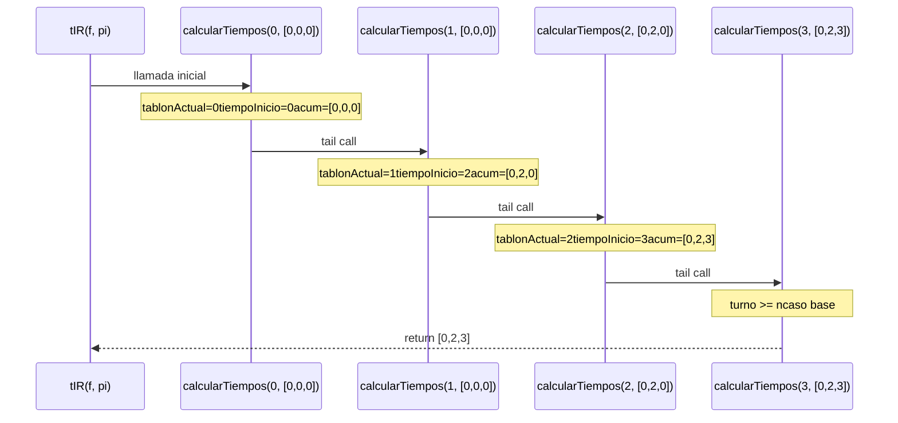
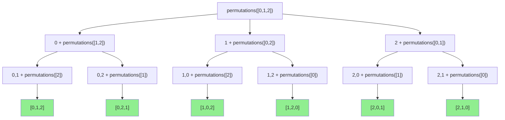
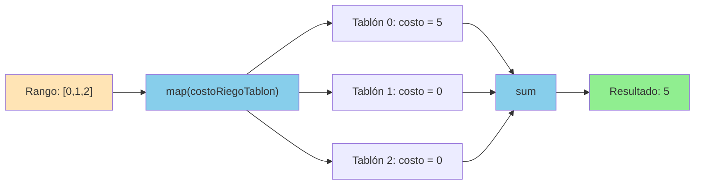
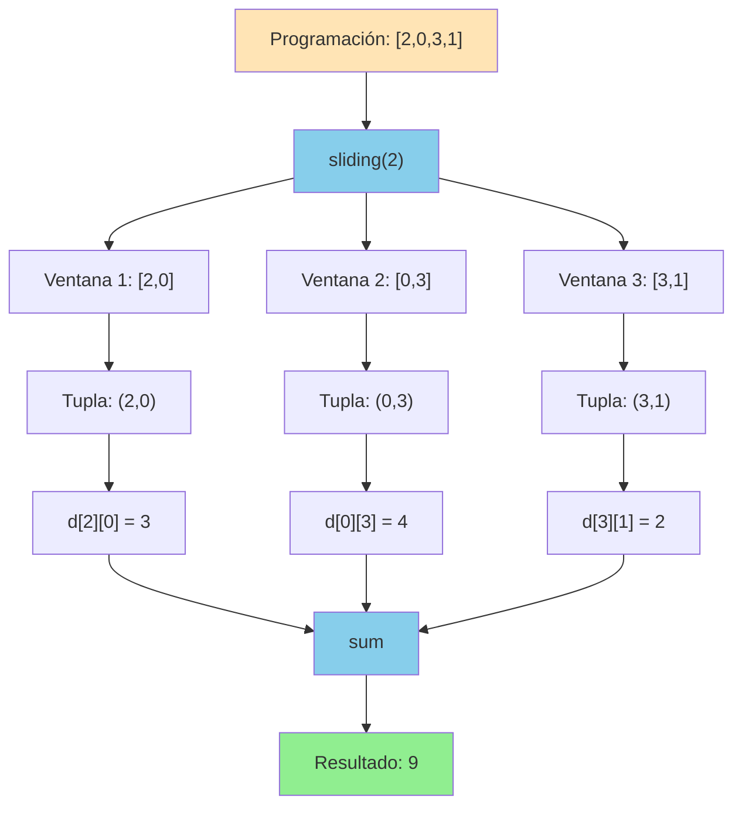

# Informe de Proceso

## Introducción

Este informe analiza los procesos generados por las funciones principales implementadas en el proyecto de Riego Óptimo. Se examina el comportamiento de cada algoritmo mediante ejemplos concretos, diagramas de flujo de ejecución y análisis de complejidad computacional.

Las funciones analizadas incluyen tanto implementaciones con recursión explícita como implementaciones basadas en funciones de alto orden del paradigma funcional.

---

## 1. Algoritmo tIR - Tiempo de Inicio de Riego

### Definición del Algoritmo
```scala
def tIR(f: Finca, pi: ProRiego): TiempoInicioRiego = {
  val n = f.length

  // Función auxiliar recursiva de cola
  def calcularTiempos(turno: Int, acumulador: TiempoInicioRiego): TiempoInicioRiego = {
    if (turno >= n) {
      // Caso base: procesamos todos los turnos
      acumulador
    } else {
      // Caso recursivo: procesar turno actual
      val tablonActual = pi(turno)

      val tiempoInicio = if (turno == 0) {
        // t^Π_π₀ = 0
        0
      } else {
        // t^Π_πⱼ = t^Π_π(j-1) + tr^F_π(j-1)
        val tablonAnterior = pi(turno - 1)
        val tiempoInicioAnterior = acumulador(tablonAnterior)
        val tiempoRiegoAnterior = Utilidades.treg(f, tablonAnterior)

        tiempoInicioAnterior + tiempoRiegoAnterior
      }

      // Actualizar acumulador y continuar
      calcularTiempos(turno + 1, acumulador.updated(tablonActual, tiempoInicio))
    }
  }

  // Iniciar recursión con vector de ceros
  calcularTiempos(0, Vector.fill(n)(0))
}
```

### Descripción del Algoritmo

La función `tIR` calcula el tiempo de inicio de riego para cada tablón de una finca siguiendo una programación de riego específica. Implementa **recursión de cola** mediante una función auxiliar interna `calcularTiempos`.

**Características principales:**
- Utiliza un **acumulador** para construir el resultado progresivamente
- La función auxiliar `calcularTiempos` recibe:
    - `turno`: índice del turno actual (0 a n-1)
    - `acumulador`: vector con los tiempos calculados hasta el momento
- Implementa las fórmulas del PDF:
    - t^Π_π₀ = 0 (el primer tablón inicia en tiempo 0)
    - t^Π_πⱼ = t^Π_π(j-1) + tr^F_π(j-1) (cada tablón inicia cuando termina el anterior)

### Explicación paso a paso

#### Caso base
```scala
if (turno >= n) {
  acumulador
}
```

Cuando se han procesado todos los turnos (turno >= n), la función retorna el acumulador con todos los tiempos calculados.

#### Caso recursivo
```scala
calcularTiempos(turno + 1, acumulador.updated(tablonActual, tiempoInicio))
```

En cada iteración:
1. Se identifica qué tablón se riega en el turno actual: `pi(turno)`
2. Se calcula el tiempo de inicio para ese tablón:
    - Si es el primer turno (turno == 0): tiempo = 0
    - Si no: tiempo = tiempo_inicio_anterior + tiempo_riego_anterior
3. Se actualiza el acumulador con el nuevo tiempo
4. Se hace la llamada recursiva con turno + 1

Como es **recursión de cola**, la llamada recursiva es la última operación, permitiendo a Scala optimizar la ejecución y evitar el desbordamiento de pila.

### Llamados de pila en recursión de cola

Ejemplo con finca de 3 tablones:
```scala
Finca f = Vector(
  (5, 2, 1),  // T0: ts=5, tr=2, p=1
  (3, 1, 2),  // T1: ts=3, tr=1, p=2
  (4, 2, 3)   // T2: ts=4, tr=2, p=3
)

Programación pi = Vector(0, 1, 2)  // Orden: T0 → T1 → T2
```

#### Paso 1: Llamada inicial
```scala
calcularTiempos(0, Vector(0, 0, 0))
```

Estado:
- turno = 0
- acumulador = [0, 0, 0]

#### Paso 2: Primera iteración
```scala
tablonActual = pi(0) = 0
tiempoInicio = 0  // primer turno
acumulador = Vector(0, 0, 0).updated(0, 0) = Vector(0, 0, 0)

calcularTiempos(1, Vector(0, 0, 0))
```

Estado:
- turno = 1
- acumulador = [0, 0, 0]
- Tablón T0 inicia en tiempo 0

#### Paso 3: Segunda iteración
```scala
tablonActual = pi(1) = 1
tablonAnterior = pi(0) = 0
tiempoInicioAnterior = acumulador(0) = 0
tiempoRiegoAnterior = treg(f, 0) = 2
tiempoInicio = 0 + 2 = 2
acumulador = Vector(0, 0, 0).updated(1, 2) = Vector(0, 2, 0)

calcularTiempos(2, Vector(0, 2, 0))
```

Estado:
- turno = 2
- acumulador = [0, 2, 0]
- Tablón T1 inicia en tiempo 2

#### Paso 4: Tercera iteración
```scala
tablonActual = pi(2) = 2
tablonAnterior = pi(1) = 1
tiempoInicioAnterior = acumulador(1) = 2
tiempoRiegoAnterior = treg(f, 1) = 1
tiempoInicio = 2 + 1 = 3
acumulador = Vector(0, 2, 0).updated(2, 3) = Vector(0, 2, 3)

calcularTiempos(3, Vector(0, 2, 3))
```

Estado:
- turno = 3
- acumulador = [0, 2, 3]
- Tablón T2 inicia en tiempo 3

#### Paso 5: Caso base
```scala
turno = 3 >= n = 3
return Vector(0, 2, 3)
```

**Resultado final:**
- T0 inicia en tiempo 0
- T1 inicia en tiempo 2 (después de regar T0 por 2 días)
- T2 inicia en tiempo 3 (después de regar T1 por 1 día)

### Diagrama de llamados de pila con recursión de cola


### Análisis de Complejidad

**Complejidad temporal:** O(n)
- Se realiza exactamente una iteración por cada tablón
- Cada iteración realiza operaciones constantes O(1):
    - Acceso a vector: O(1)
    - Actualización de vector: O(n) pero amortizado O(1) con estructuras persistentes
    - Operaciones aritméticas: O(1)

**Complejidad espacial:** O(n)
- Se mantiene un vector acumulador de tamaño n
- La recursión de cola es optimizada por Scala a un bucle iterativo
- No se acumulan llamadas en la pila (tail recursion)

**Tipo de recursión:** Recursión de cola optimizada

---

## 2. Algoritmo generarProgramacionesRiego

### Definición del Algoritmo
```scala
def generarProgramacionesRiego(f: Finca): Vector[ProRiego] = {
  val n = f.length
  // Genera todas las permutaciones del vector 0..n-1
  (0 until n).toVector.permutations.map(_.toVector).toVector
}
```

### Descripción del Algoritmo

La función `generarProgramacionesRiego` genera todas las posibles programaciones de riego para una finca, donde cada programación es una permutación de los índices de los tablones (0 hasta n-1).

**Características principales:**
- Utiliza el método `permutations` de la biblioteca estándar de Scala
- `permutations` implementa internamente un algoritmo recursivo para generar todas las permutaciones
- Convierte cada permutación a Vector para mantener consistencia de tipos
- Genera n! (factorial de n) programaciones

### Explicación del Proceso

Aunque la recursión no es explícita en el código, el método `permutations` implementa internamente un algoritmo recursivo similar al siguiente pseudocódigo:
```
permutaciones(lista):
  si lista está vacía:
    return [[]]  // permutación vacía
  sino:
    resultado = []
    para cada elemento en lista:
      resto = lista sin el elemento
      para cada perm en permutaciones(resto):
        resultado.agregar([elemento] + perm)
    return resultado
```

### Llamados de pila para caso pequeño

Ejemplo con finca de 3 tablones:
```scala
Finca f = Vector((5,2,1), (3,1,2), (4,2,3))
n = 3
Índices: [0, 1, 2]
```

#### Árbol de generación de permutaciones


#### Resultado

Se generan 3! = 6 permutaciones:
```scala
Vector(
  Vector(0, 1, 2),  // T0 → T1 → T2
  Vector(0, 2, 1),  // T0 → T2 → T1
  Vector(1, 0, 2),  // T1 → T0 → T2
  Vector(1, 2, 0),  // T1 → T2 → T0
  Vector(2, 0, 1),  // T2 → T0 → T1
  Vector(2, 1, 0)   // T2 → T1 → T0
)
```

### Ejemplo paso a paso para n=3

#### Nivel 1: Elegir el primer elemento
```
Opciones: 0, 1, 2
  ├─ Elegir 0 → permutar [1,2]
  ├─ Elegir 1 → permutar [0,2]
  └─ Elegir 2 → permutar [0,1]
```

#### Nivel 2: Elegir el segundo elemento (rama 0)
```
Tenemos 0, falta permutar [1,2]
  ├─ Elegir 1 → permutar [2] → resultado: [0,1,2]
  └─ Elegir 2 → permutar [1] → resultado: [0,2,1]
```

#### Nivel 2: Elegir el segundo elemento (rama 1)
```
Tenemos 1, falta permutar [0,2]
  ├─ Elegir 0 → permutar [2] → resultado: [1,0,2]
  └─ Elegir 2 → permutar [0] → resultado: [1,2,0]
```

#### Nivel 2: Elegir el segundo elemento (rama 2)
```
Tenemos 2, falta permutar [0,1]
  ├─ Elegir 0 → permutar [1] → resultado: [2,0,1]
  └─ Elegir 1 → permutar [0] → resultado: [2,1,0]
```

### Análisis de Complejidad

**Complejidad temporal:** O(n! × n)
- Se generan n! permutaciones
- Cada permutación toma O(n) tiempo para construirse
- Para n=5: 5! = 120 permutaciones
- Para n=10: 10! = 3,628,800 permutaciones (explosión combinatoria)

**Complejidad espacial:** O(n! × n)
- Se almacenan todas las n! permutaciones
- Cada permutación ocupa O(n) espacio

**Tipo de recursión:** Recursión implícita múltiple (árbol de decisiones)

**Nota sobre el crecimiento:** El número de permutaciones crece factorialmente, haciendo que el problema sea intratable para valores grandes de n (n > 10-12).

---

## 3. Algoritmo costoRiegoFinca

### Definición del Algoritmo
```scala
def costoRiegoFinca(f: Finca, pi: ProRiego): Int = {
  (0 until f.length).map(i => costoRiegoTablon(i, f, pi)).sum
}
```

### Descripción del Algoritmo

La función `costoRiegoFinca` calcula el costo total de riego para todos los tablones de una finca dada una programación específica. Utiliza **programación funcional con funciones de alto orden** en lugar de recursión explícita.

**Características principales:**
- Utiliza `map` para aplicar `costoRiegoTablon` a cada tablón
- Suma todos los costos individuales con `sum`
- Enfoque declarativo: expresa QUÉ calcular, no CÓMO hacerlo

### Función auxiliar: costoRiegoTablon
```scala
def costoRiegoTablon(i: Int, f: Finca, pi: ProRiego): Int = {
  val ts = tsup(f, i)    // Tiempo de supervivencia
  val tr = treg(f, i)    // Tiempo de riego
  val tp = prio(f, i)    // Prioridad
  val t = tIR(f, pi)(i)  // Tiempo de inicio
  
  // Fórmula del PDF:
  if (ts - tr >= t) {
    ts - (t + tr)        // Sin sufrimiento
  } else {
    tp * ((t + tr) - ts) // Con penalización por prioridad
  }
}
```

### Explicación paso a paso

#### Ejemplo con finca de 3 tablones
```scala
Finca f = Vector(
  (8, 3, 2),  // T0: ts=8, tr=3, p=2
  (5, 2, 3),  // T1: ts=5, tr=2, p=3
  (6, 1, 1)   // T2: ts=6, tr=1, p=1
)

Programación pi = Vector(0, 1, 2)
Tiempos de inicio: tIR(f, pi) = Vector(0, 3, 5)
```

#### Paso 1: Crear rango de índices
```scala
(0 until 3) = Range(0, 1, 2)
```

#### Paso 2: Mapear cada índice al costo
```scala
map(i => costoRiegoTablon(i, f, pi))
```

**Para i = 0 (T0):**
```scala
ts = 8, tr = 3, tp = 2, t = 0
ts - tr = 8 - 3 = 5 >= t = 0  ✓
costo = ts - (t + tr) = 8 - (0 + 3) = 5
```

**Para i = 1 (T1):**
```scala
ts = 5, tr = 2, tp = 3, t = 3
ts - tr = 5 - 2 = 3 >= t = 3  ✓ (límite exacto)
costo = ts - (t + tr) = 5 - (3 + 2) = 0
```

**Para i = 2 (T2):**
```scala
ts = 6, tr = 1, tp = 1, t = 5
ts - tr = 6 - 1 = 5 >= t = 5  ✓ (límite exacto)
costo = ts - (t + tr) = 6 - (5 + 1) = 0
```

#### Paso 3: Resultado del map
```scala
Vector(5, 0, 0)
```

#### Paso 4: Sumar todos los costos
```scala
Vector(5, 0, 0).sum = 5
```

**Resultado final:** El costo total de riego es 5

### Diagrama de flujo de datos


### Equivalencia con recursión

El uso de `map` es equivalente a la siguiente función recursiva:
```scala
def mapRecursivo(lista: List[Int], f: Int => Int): List[Int] = lista match {
  case Nil => Nil
  case x :: xs => f(x) :: mapRecursivo(xs, f)
}
```

En este caso, `map` abstrae el patrón recursivo de "aplicar una función a cada elemento de una lista".

### Análisis de Complejidad

**Complejidad temporal:** O(n × T(costoRiegoTablon))
- `map` itera sobre n elementos: O(n)
- Cada llamada a `costoRiegoTablon` incluye una llamada a `tIR`: O(n)
- **Total:** O(n²) en el peor caso

**Optimización posible:** Calcular `tIR` una sola vez y reutilizar:
```scala
val tiempos = tIR(f, pi)
(0 until f.length).map(i => costoRiegoTablonConTiempos(i, f, tiempos)).sum
```
Esto reduciría la complejidad a O(n).

**Complejidad espacial:** O(n)
- Vector temporal con n costos
- Cada costo es un Int (O(1))

**Paradigma:** Programación funcional con funciones de alto orden (map/reduce)

---

## 4. Algoritmo costoMovilidad

### Definición del Algoritmo
```scala
def costoMovilidad(f: Finca, pi: ProRiego, d: Distancia): Int = {
  val parejas = pi.sliding(2).map{case Vector(a,b) => (a,b)}.toVector
  (0 until parejas.length).map(i => d(parejas(i)._1)(parejas(i)._2)).sum
}
```

### Descripción del Algoritmo

La función `costoMovilidad` calcula el costo total de mover el sistema de riego entre tablones consecutivos según el orden de la programación. Utiliza la función de alto orden `sliding` para crear ventanas deslizantes.

**Características principales:**
- `sliding(2)` crea ventanas de 2 elementos consecutivos
- Cada ventana representa un movimiento: tablón actual → tablón siguiente
- Suma las distancias entre cada par consecutivo
- Enfoque funcional: composición de operaciones sobre colecciones

### Explicación paso a paso

#### Ejemplo con finca de 4 tablones
```scala
Programación pi = Vector(2, 0, 3, 1)
// Orden de riego: T2 → T0 → T3 → T1

Matriz de distancias d:
     0   1   2   3
0 [  0,  2,  3,  4 ]
1 [  2,  0,  5,  2 ]
2 [  3,  5,  0,  6 ]
3 [  4,  2,  6,  0 ]
```

#### Paso 1: Aplicar sliding(2)
```scala
pi.sliding(2) genera:
  Iterator(
    Vector(2, 0),  // T2 → T0
    Vector(0, 3),  // T0 → T3
    Vector(3, 1)   // T3 → T1
  )
```

**Visualización:**
```
[2, 0, 3, 1]
 └─┘         ventana 1: (2, 0)
    └─┘      ventana 2: (0, 3)
       └─┘   ventana 3: (3, 1)
```

#### Paso 2: Convertir a tuplas
```scala
map{case Vector(a,b) => (a,b)}.toVector

Vector(
  (2, 0),  // Par 1
  (0, 3),  // Par 2
  (3, 1)   // Par 3
)
```

#### Paso 3: Mapear cada par a su distancia
```scala
parejas = Vector((2,0), (0,3), (3,1))

Para i = 0: d(2)(0) = 3  // Distancia T2 → T0
Para i = 1: d(0)(3) = 4  // Distancia T0 → T3
Para i = 2: d(3)(1) = 2  // Distancia T3 → T1
```

#### Paso 4: Sumar las distancias
```scala
Vector(3, 4, 2).sum = 9
```

**Resultado final:** El costo total de movilidad es 9

### Diagrama de flujo del proceso


### Ejemplo con n = 1 (caso borde)
```scala
Programación pi = Vector(0)  // Solo un tablón

pi.sliding(2) genera: Iterator()  // Vacío, no hay pares

parejas = Vector()
sum = 0  // No hay movimientos
```

### Ejemplo visual del proceso sliding

Para `pi = Vector(2, 0, 3, 1, 4)`:
Iteración 1:
[2, 0, 3, 1, 4]
└─┘
↓
(2, 0) → distancia d(2)(0)
Iteración 2:
[2, 0, 3, 1, 4]
└─┘
↓
(0, 3) → distancia d(0)(3)
Iteración 3:
[2, 0, 3, 1, 4]
└─┘
↓
(3, 1) → distancia d(3)(1)
Iteración 4:
[2, 0, 3, 1, 4]
└─┘
↓
(1, 4) → distancia d(1)(4)
Total: suma de 4 distancias

### Análisis de Complejidad

**Complejidad temporal:** O(n)
- `sliding(2)` genera n-1 ventanas: O(n)
- Cada acceso a la matriz de distancias: O(1)
- Suma final: O(n)

**Complejidad espacial:** O(n)
- Vector de parejas: n-1 elementos
- Cada par es una tupla de 2 enteros: O(1)

**Paradigma:** Programación funcional con ventanas deslizantes

**Nota:** Si la programación tiene solo 1 tablón, no hay movimientos (costo = 0).

---

## 5. Comparación de Enfoques

### Tabla comparativa

| Función | Tipo de recursión | Complejidad temporal | Complejidad espacial | Paradigma |
|---------|-------------------|----------------------|----------------------|-----------|
| `tIR` | Recursión de cola explícita | O(n) | O(n) | Recursión funcional |
| `generarProgramacionesRiego` | Recursión implícita múltiple | O(n! × n) | O(n! × n) | Generación exhaustiva |
| `costoRiegoFinca` | Iteración con map | O(n²)* | O(n) | Funciones de alto orden |
| `costoMovilidad` | Iteración con sliding | O(n) | O(n) | Procesamiento de ventanas |

*Puede optimizarse a O(n) calculando tIR una sola vez.

### Ventajas de cada enfoque

#### Recursión de cola (`tIR`)
**Ventajas:**
- ✅ Eficiencia espacial (optimizada a bucle)
- ✅ Expresiva y fácil de verificar formalmente
- ✅ Sigue directamente las fórmulas matemáticas del PDF

**Desventajas:**
- ❌ Requiere pensar en términos de acumuladores

#### Recursión múltiple (`generarProgramacionesRiego`)
**Ventajas:**
- ✅ Genera soluciones exhaustivas (garantiza encontrar el óptimo)
- ✅ Expresión natural del problema combinatorio

**Desventajas:**
- ❌ Crecimiento factorial (intratable para n > 12)
- ❌ Consumo masivo de memoria

#### Funciones de alto orden (`costoRiegoFinca`, `costoMovilidad`)
**Ventajas:**
- ✅ Código conciso y declarativo
- ✅ Fácil de entender y mantener
- ✅ Composición de operaciones estándar

**Desventajas:**
- ❌ Puede ocultar ineficiencias (múltiples recorridos)
- ❌ Menos control sobre el flujo de ejecución

---

## Conclusiones

### Tipos de recursión identificados

1. **Recursión de cola optimizada**: Implementada en `tIR`, permite procesar secuencias largas sin desbordamiento de pila.

2. **Recursión múltiple implícita**: Usada en `generarProgramacionesRiego` para explorar el árbol de decisiones de permutaciones.

3. **Iteración funcional**: Aplicada en `costoRiegoFinca` y `costoMovilidad` mediante funciones de alto orden como `map` y `sliding`.

### Eficiencia y escalabilidad

- **tIR**: Escala linealmente con el número de tablones. Adecuado para fincas de cualquier tamaño práctico.

- **generarProgramacionesRiego**: Crece factorialmente. Solo viable para n ≤ 10-12 tablones. Para problemas mayores se requieren heurísticas.

- **Funciones de costo**: Escalabilidad lineal o cuadrática. Optimizables mediante memoización de resultados intermedios.

### Paradigma funcional

Todas las implementaciones siguen principios de **programación funcional**:
- ✅ Inmutabilidad de datos
- ✅ Funciones puras (sin efectos secundarios)
- ✅ Composición de funciones
- ✅ Recursión en lugar de ciclos imperativos

Este enfoque facilita:
- **Verificación formal**: Más fácil demostrar corrección mediante inducción
- **Paralelización**: Las funciones puras son inherentemente paralelizables
- **Mantenibilidad**: Código más declarativo y comprensible
- **Testing**: Funciones puras son más fáciles de probar

### Consideraciones para el rendimiento

Para mejorar el rendimiento en casos de uso real se pueden aplicar:

1. **Memoización**: Cachear resultados de `tIR` para evitar recálculos en `costoRiegoFinca`
    - Actualmente se recalcula tIR en cada llamada a costoRiegoTablon
    - Solución: calcular una sola vez y pasar como parámetro

2. **Paralelización**: Implementar versiones paralelas de las funciones de costo
    - `costoRiegoFincaPar`: Dividir cálculo entre múltiples núcleos
    - `generarProgramacionesRiegoPar`: Generar permutaciones en paralelo

3. **Algoritmos aproximados**: Para n grande, usar heurísticas en lugar de fuerza bruta
    - Algoritmos greedy (voraz)
    - Algoritmos genéticos
    - Simulated annealing
    - Branch and bound con poda

4. **Poda temprana**: En la generación de permutaciones, descartar ramas subóptimas
    - Usar cotas inferiores del costo
    - Eliminar programaciones claramente peores sin evaluarlas completamente

### Lecciones aprendidas

El análisis de estos procesos revela:

1. **La recursión de cola es eficiente**: `tIR` puede procesar fincas de cualquier tamaño razonable sin problemas de memoria.

2. **La explosión combinatoria es real**: `generarProgramacionesRiego` demuestra por qué los problemas NP-completos son difíciles. Con n=10 tablones ya tenemos más de 3 millones de permutaciones.

3. **Las funciones de alto orden simplifican el código**: `map`, `sliding`, y `sum` permiten expresar algoritmos complejos de forma concisa.

4. **El paradigma funcional facilita el razonamiento**: La ausencia de estado mutable hace más fácil entender y verificar el comportamiento de cada función.

### Aplicabilidad

Los patrones de recursión y procesamiento funcional analizados en este proyecto son aplicables a:
- Problemas de optimización combinatoria
- Scheduling y planificación de recursos
- Procesamiento de secuencias y series temporales
- Análisis de grafos y rutas

---